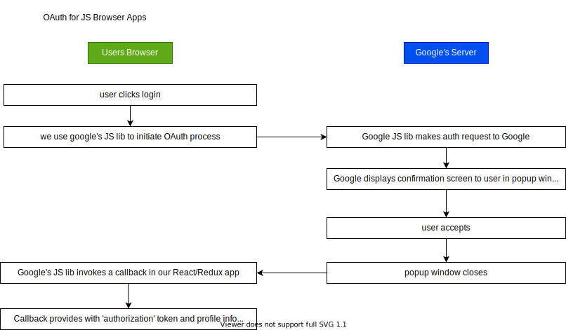

## High Level Introduction

Real Time Messaging Protocol (RTMP) Server. The app will be a clone to twitch.tv in a non too complex level. 

twitch.tv is a very popular site to record video on their desktop and stream it live to their viewers. 

This application consists of three applications to make this possible. Each are required to be started via 'npm start'

Reason for this app was to get a practice of CRUD operations (create - read - update - destroy)

### `api`

made use of json-server instead of something like node/express server. Besides json-server has a extremly strict adherence to REST conventions which is great practice anyways making use of (GET/GET:id/POST/PUT/DELETE)

references:
[npm json-server](https://www.npmjs.com/package/json-server)

### `client`

made use of google OAuth (for JS browsers) for the login process

TODO: update some notes about React feature 'Portal' that was used for a modal window

references:
[npm axios]()
[npm flv.js]()
[npm lodash]()
[npm react-redux]()
[npm react-router-dom]()
[npm redux]()
[npm redux-form]()
[npm redux-thunk]()

### `rtmpserver`

TODO: update notes
