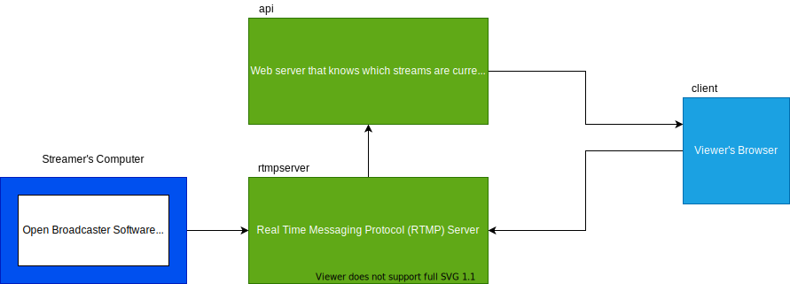

## High Level Introduction

Real Time Messaging Protocol (RTMP) Server. The app will be a clone to twitch.tv in a non too complex level,

twitch.tv is a very popular site to record video on their desktop and stream it live to their viewers.

This application consists of three applications to make this possible. Each are required to be started via 'npm start'

### `api`

TODO: update notes

Runs the app in the development mode. 
Open [http://localhost:3000](http://localhost:3000) to view it in the browser.

The page will reload if you make edits. 
You will also see any lint errors in the console.

### `client`

TODO: update notes

Launches the test runner in the interactive watch mode. 
See the section about [running tests](https://facebook.github.io/create-react-app/docs/running-tests) for more information.

### `rtmpserver`

TODO: update notes

Builds the app for production to the `build` folder. 
It correctly bundles React in production mode and optimizes the build for the best performance.

The build is minified and the filenames include the hashes. 
Your app is ready to be deployed!

See the section about [deployment](https://facebook.github.io/create-react-app/docs/deployment) for more information.
